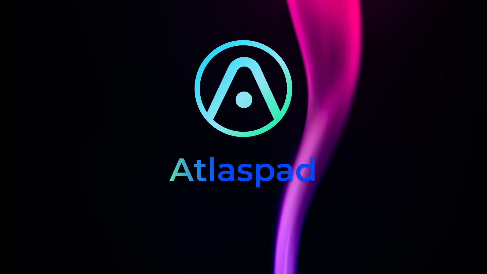

# 🔮 Atlaspad Trustless zk-Launchpad

<figure><figcaption>
Atlaspad Image
</figcaption></figure>

**Atlaspad**, introduces a the first and only trustless **Cross-Chain** **ZK Launchpad** that utilizes zero-knowledge proofs to enable secure and private transactions across multiple blockchains. This cutting-edge platform addresses the pressing issues of privacy and high transaction costs in DeFi by allowing users to:

* Participate in presales of upcoming projects without revealing their investment size or strategy.
* Stake assets within a privacy-preserving ecosystem that interlinks with multiple blockchains like Ethereum, Binance Smart Chain, and Mina Protocol.
* Validate transactions and prove asset ownership without exposing any sensitive information through a novel Merkle tree-based architecture.

This launchpad is designed to empower users with the freedom to move assets across chains discreetly and efficiently, fostering a new paradigm in the DeFi space where privacy and cross-chain functionality coexist seamlessly.

### Summary&#x20;

In today's cryptocurrency ecosystem, the use of launchpads has become increasingly common among investors, facilitating cross-scale crypto asset transactions. Launchpads are typically either centralized or decentralized structures, supported by a single network. According to the crypto-economic trilemma, if a launchpad is centralized, it can gain speed at the expense of security; if it is decentralized, it offers reliability but may adversely affect transaction speed. The major issues for any launchpad and its users, especially investors, revolve around **security** and **privacy**. Despite being preferred for their unverified transactions, launchpads have been subject to abuse within the crypto finance sector. Additionally, when they are verified, problems such as disproportionate centralization and the exploitation of data security arise. Moreover, the absence of any zk-Launchpad on the MINA network and the fact that MINA's EVM compatibility, aside from the auro wallet, is less preferred due to the lack of stable tokens, have led us to make the decision to solve all these problems. _We aim to construct a system that can be entirely verified and anonymous while also increasing user involvement in the MINA network, which we genuinely consider as a solution, by addressing these issues with our developer team, experienced staff, and, of course, "**zkproof**."_

