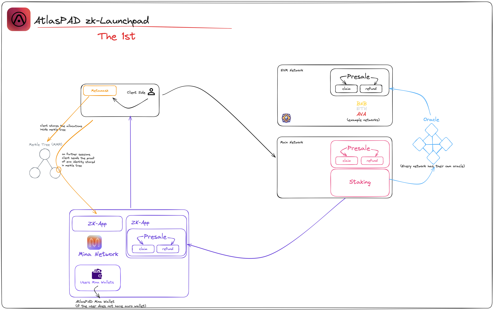

# Architecture of "Atlaspad"

<div data-full-width="true">

<figure><figcaption><p>Architecture of zkApp Launchpad</p></figcaption></figure>

</div>

**Platform Design and Layers**

**`0. Frontend Layer`**

_The Frontend/Backend Layer is the interface between the user and the platform, providing a responsive UI that adjusts to various devices and screen sizes, enhancing accessibility and ensuring a consistent user experience. The Web Client facilitates seamless interaction with blockchain services, while the AI Chatbot serves as an on-demand guide for user assistance and support._

Architecture Highlights:

**1. Responsive Platform UI:** _Adapts to any device, offering a frictionless user interface._\
**2. Web Client:** _Ensures robust performance and reliable transactions._\
**3. AI Chatbot:** _Provides intelligent support, enhancing user engagement._

**4. Crypto Dashboard:** _Enhancing user engagement._\
&#x20;

**Why It's the Right Choice:**

\- _The responsive UI is a must in today's multi-device world, ensuring no user is left behind._\
\- _A dedicated Web Client is essential for maintaining a secure and stable connection to blockchain networks._\
\- _The AI Chatbot is not just a support tool but a feature that can significantly enhance user retention and satisfaction._\


<div data-full-width="true">

<figure><figcaption><p>Layer Schemata</p></figcaption></figure>

</div>


**`1. User Interface Layer`**

Components:

**- MetaMask Plugin:** _The interface through which the user interacts with Ethereum and other EVM compatible networks. It provides crypto wallet functionality and gives the user the ability to send and receive tokens on the network._\
**- Mina Wallet App (AtlasPad):** _An interface with manual transaction capability for users without an automated wallet._

Functionality:

\- _Users initiate presale or staking transactions through this layer and manage the authentication process._\
\- _Authentication based on Merkle Tree and token allocation information is entered through this layer._\
&#x20;

**`2. Application Layer`**

Components:

**- ZK Application (ZK-App):** _Software running on the Mina network that ensures the privacy and security of user transactions using zero-knowledge proofs._\
**- Presale and Refund Modules:** _Provides users with the ability to purchase or refund tokens._

Functionality:

\- _This layer utilizes the lightweight nature of the Mina network, allowing users to prove transactions while protecting their credentials._\
\- _Users can perform presale transactions or request a refund if needed._

**`3. Network Layer`**

Components:

**- Main Network:** _Hosts the presale and staking modules and contains separate oracles for each blockchain._\
**- EVM Network:** _Represents EVM-compatible networks such as Binance Smart Chain (BSC), Ethereum (ETH), Avalanche (AVAX) and is used for presale transactions._\
**- Mina Network:** _The network where ZK-App runs and user data is stored._

Functionality:

\- _Each blockchain network uses its own oracle for price information and other external data._\
\- _Users can perform staking transactions and stake their tokens through this layer._\
&#x20;

**`4. Data Storage and Verification Layer`**

_The Data Layer employs Merkle Mountain Ranges for data integrity and offers off-chain storage with homomorphic encryption for enhanced security. It also utilizes IPFS or Celestia for data availability, ensuring that the launchpad’s data remains accessible and immutable._

Components:

**- Merkle Tree(MMR-Merkle Mountain Ranges):**  _Data structure that stores users' token allocations and authentication information._\
_The Merkle Proof consists of a construction that shows how to locate an input (OutX) in the total set of outputs MMR._\
\
_Merkle Mountain Ranges is a structure used as an alternative to traditional Merkle trees. Merkle Mountain Ranges is a fully additive structure and items are added from left to right. MMR can be seen as a list of fully balanced binary trees of elements or as a single binary tree cut from the top right. MMR is used in the Grin project to store kernel, outputs and range proofs._\
&#x20;

**Structure and Functions**

* **Height:** _The height of each node in the MMR is obtained from the row to which it is added._
*   **Hashing and Branching:** _The parent nodes in MMR contain the hash of its two children. Grin uses the_ **`Blake2b`** _hash function and always adds the position of the node before hashing. For example, if a leaf contains_ **`l`**, index **`n`** and data **`D`**:

    
    ```javascript
    Node(l) = Blake2b(n | D)
    ```
    
* **Bagging the Peaks:** _A process is used to find the peaks in the MMR. The first left-hand peak is always the highest and always has a position "filled with ones". The position of the first peak can be expressed as_ `2^n - 1,`_which is smaller than the total size of the MMR. To find the other peaks, we move to their right siblings. This process is repeated until the positions of the peaks are determined._
* **Pruning:** _In Grin, some of the data in MMRs can be removed over time. In doing so, some leaves become redundant and their hashes can be removed. When enough leaves are removed, the existence of their parent nodes may also become redundant. Therefore, a significant portion of the MMR can be pruned by removing its leaves._\
  \
  Merkle Proof includes the following:\
  \- _The hash of the leaf representing `OutX.`_\
  \- _The hash of the overall root in the tree._\
  \- _A sequence of hashes representing all MMR vertices (this shows that together they form the overall root).- A list of sibling hashes to enable the construction of the branch from OutX to the top._\
  \- _A list of sibling positions (left/right) to ensure the correct reconstruction of the branch. Merkle Proof is used to prove that a node is below its vertex and show that the vertexes form the overall root._


<figure><figcaption><p>Merkle Tree</p></figcaption></figure>

\
**Coinbase Output:**\
_The wallet holds a Merkle Proof (and the corresponding block hash) for each unused coinbase output. In order to spend the coinbase output, the block hash and Merkle Proof must be provided on entry. This is used to verify coinbase maturity and does not require full block data._\
Wallet Verification:

\
**- Initial Setup:** _Each user's wallet is associated with a unique leaf in the MMR. When a user registers or makes their first transaction, their wallet's public information and a unique identifier (nullifier) are hashed and added to the MMR._

\
**- zk-Proof Generation:** _When a user initiates a session, they generate a zk-Proof that attests to the existence of their wallet's hash in the MMR without revealing the wallet's actual details. This proof can confirm the wallet's validity and the user's ownership securely and privately_.

\
**Transaction Processing:**\
**- Transaction Verification:** _When a transaction is initiated, the MMR is used to verify that the participating wallets are valid and have not been double-spent. This verification is done by generating a zk-Proof that attests to the presence of the wallets' identifiers in the MMR and the absence of these identifiers in the list of spent nullifiers._\
**- Update Mechanism:** _Once a transaction is verified and completed, the MMR is updated. This update includes appending new transactions and pruning spent outputs, which is critical for maintaining the MMR's efficiency and compactness._\
\
**- ZK Proofs:** Cryptographic proofs used to protect users' privacy while verifying the validity of their transactions.

Functionality:

_- The Merkle Tree is required for users to prove their identity and token allocation in each session._\
\- _ZK Proofs allow users to prove the authenticity of their transactions without revealing any personal information on the network._

Architecture Highlights:

_- Off-Chain Storage with Homomorphic Encryption: Provides a secure way to compute on encrypted data._\
_- IPFS or Celestia Data Availability: Offers decentralized storage solutions for persistent data availability._

**`5. Oracle Layer`**

_Our primary objective is to incorporate the use of oracles into our system. To achieve this, we are planning to write a distinct Oracle for each Ethereum Virtual Machine (EVM) network that is connected to our zkApp. This is a deliberate strategy we are adopting in order to ensure robust and efficient communication and interaction between the various networks. We believe this is the most optimized and least compromising strategy available._\
\
_• In Atlas Oracle we will create ABIs to integrate with external data providers (contracts and user). These ABI functions will communicate with Merkle Tree to work with other MINA wallets to write an Oracle in each network._

<div align="center" data-full-width="false">

<figure><figcaption><p>Oracle</p></figcaption></figure>

</div>

**`6. Wallet Layer:`**

_Especially when we encourage the use of MINA's wallet and associate the EVM-based wallet with the MINA wallet, EVM users will be indirectly encouraged into the MINA ecosystem as our platform will create an interlinked MINA wallet for them seamlessly (if they lack it) behind the scenes and more zkApp projects will come for our Launchpad. The Wallet Layer is where financial management takes place. It encompasses core functionalities such as transaction management and user wallet services. Cross-chain compatibility and blockchain network communication signify the layer's ability to interact smoothly across different blockchain infrastructures._&#x20;

Architecture Highlights:

**1. Core Function/Implementation:** _Manages all wallet operations with high security and efficiency._\
**2. User Wallets/Transaction Management:** _Provides users with full control over their transactions and funds._\
**3. Cross-Chain Compatibility:** _Ensures the wallet can operate over multiple blockchains, increasing its utility._

<figure><figcaption><p>zk-Wallet</p></figcaption></figure>


**Why It's the Right Choice:**

\- _The focus on core wallet functionalities ensures a secure and reliable financial environment._\
\
\----------------------------------------------------------------------------------------------------------------

\
**Technology**\
\- _ZK launchpad investigates interactions of the complex structure between ever-growing blockchain ecosystem_\
\- _Provides asset management across multiple blockchains such as mina and EVM blockchains- Improves the privacy and security of user with the use of Merkle Trees and zero-knowledge proofs._\
&#x20;

• _In the zkApp section of our Launchpad, when a user provides their MetaMask wallet, zkApp associates an Atlaspad Mina wallet with the user (client side) and returns it. To examine this process in detail, you can refer to the diagrams available in the links._\
• _Launchpad utilizes **MMR Merkle Tree** algorithms in zkApp's offchain database and performs **nullifier** operations for access tokens to conduct zk-proof verifications._\
• _There is **no KPI** due to zkApps_

\
\
**System Components**\
\
**1. Client Side:**\
**- MetaMask:** _A crypto wallet plugin that enables trading on EVM-compliant networks._\
**- Merkle Tree:** _The data structure where users store their token allocations._\
\
**2. ZK Application (ZK-App):**\
\- _An application that runs on the Mina network and uses zero-knowledge proof._\
\- _It has presale and redemption functionality._\
\
**3. Main Network:**\
\- Includes presale and staking modules.\
\- It hosts a separate oracle (data source) for each blockchain.\
\
**4. EVM Network:**\
\- _Includes example networks such as Bnb, Eth, Avalanche._\
\- _It is used for presale functions and is integrated with an oracle._\


<div data-full-width="true">

<figure><figcaption><p>Scenerio of Atlaspad</p></figcaption></figure>

</div>

\
**Functionality**

\
**Presale Operations**\
\- _Users access the presale module through MetaMask and manage their tokens on EVM-compliant networks._\
\- _In this process, users' credentials and allocated token amounts are stored in the Merkle tree._\
**Staking Operations**\
\- _Users can stake their tokens by accessing the staking module on the main network._\
\- _Since each network has its own oracle, price information and other external data from different networks is provided through these oracles._\
**Security and Privacy**\
\- _ZK-App uses zero-knowledge proof technology to prove the authenticity of transactions while protecting the user's identity._\
\- _Users can make secure and confidential transactions by leveraging the lightweight and privately protected nature of the Mina network._\
**Result**\
\- _The Atlaspad ZK launchpad provides a secure and privacy-focused platform for crypto trading._\
\- _The Merkle tree and zero-knowledge proof technologies are used create a secure experience for users, while ensuring that presale and staking functions are fully reliable, easy and efficient._\
\-----------------------------------------------------------------------------------------------------------------

**Contract List**

<figure><figcaption><p>Contract Networks</p></figcaption></figure>

\
**`Oracle Contract`**` ``-solidity`\
**`TokenLocker Contract`**` ``-solidity`\
**`TokenStake Contract`**` ``-solidity`\
**`TokenBurn Contract`**` ``-solidity`\
**`TokenAirdrop Contract`**` ``-solidity`\
**`TokenWithdraw Contract`**` ``-solidity`\
**`TokenSwap Contract`**` ``-solidity`\
**`NFTmint Contract`**` ``-solidity`\
**`TokenClaim Contract`**` ``-solidity`\
**`PrivatePresale Contract`**` ``-solidity`\
**`PublicPresale Contract`**` ``-solidity`\
**`MinaPresale Contract`**` ``- o1js`\
**`Mina Claim Contract`**` ``- o1js`

\--------------------------------------------------------------------------------------------------------------------

**LINKS FOR ARCHITECTURE**

\
**Main Diagram:** [https://drive.google.com/file/d/1TXYCXCvuAvhIo7zmdxKimLUGs5smcgjy/view?usp=sharing](https://drive.google.com/file/d/1TXYCXCvuAvhIo7zmdxKimLUGs5smcgjy/view?usp=sharing)\
**Scenerio:** [https://drive.google.com/file/d/1DgexHczhWePgODLLV\_dy7FFIkoeXTh4Q/view?usp=sharing](https://drive.google.com/file/d/1DgexHczhWePgODLLV\_dy7FFIkoeXTh4Q/view?usp=sharing)\
**Contract Diagrams:** [https://drive.google.com/drive/folders/1SL3oP\_tLkIEL3JHTayTLrU5p--DCpPRM?usp=sharing](https://drive.google.com/drive/folders/1SL3oP\_tLkIEL3JHTayTLrU5p--DCpPRM?usp=sharing)\
**Merkle Schemata:** [https://drive.google.com/file/d/1OwpVW72CFFoyO6lY3W4--BYSQ6N64s4\_/view?usp=sharing](https://drive.google.com/file/d/1OwpVW72CFFoyO6lY3W4--BYSQ6N64s4\_/view?usp=sharing)\
**Layer Schemata:** [https://drive.google.com/file/d/1QXcNxSSMq9EMT4AaGGbuvP\_UaezNQuqK/view?usp=sharing](https://drive.google.com/file/d/1QXcNxSSMq9EMT4AaGGbuvP\_UaezNQuqK/view?usp=sharing)\
**Website:** [www.atlaspad.io](http://www.atlaspad.io/)\
**Non-zk Old Docs Page (for finance):** [https://docs.atlaspad.io](https://docs.atlaspad.io/)\
**All:** [https://drive.google.com/drive/folders/1Ka\_RfkbvvfnM5Xze6W0rnwX--EQNN4jd?usp=sharing](https://drive.google.com/drive/folders/1Ka\_RfkbvvfnM5Xze6W0rnwX--EQNN4jd?usp=sharing)\
​​​​​​​**Excalidraw:** [https://excalidraw.com/#room=c11c88dfb9c671a78113,tJiNKtr1vd9St9ZwMlZ-Fg](https://excalidraw.com/#room=c11c88dfb9c671a78113,tJiNKtr1vd9St9ZwMlZ-Fg)
