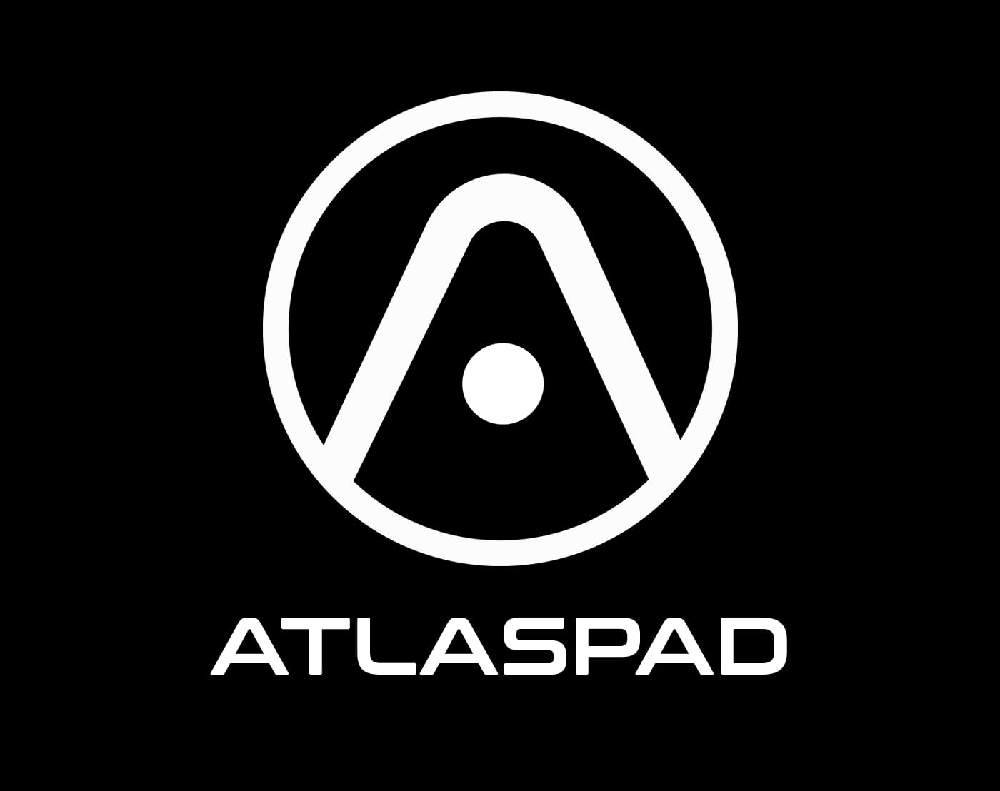

# 📑 Go-to-Market Strategy for "AtlasPad"

<figure><figcaption>
Atlaspad
</figcaption></figure>

**`MVP Development:`**

\
<mark style="color:purple;">**1. Definition of MVP:**</mark>\
\- The MVP will be a streamlined version of the AtlasPad platform, featuring core functionalities that align with our mission of simplifying financing and launch processes for crypto projects.

\
<mark style="color:purple;">**2. Core MVP Features:**</mark>\
\- Project Listings: Entrepreneurs can submit project proposals, detailing their crypto projects and funding requirements.\
\- Investor Dashboard: Investors can browse and invest in listed projects, with features for tracking investments and accessing relevant data.\
\- Smart Contracts: Implementation of essential smart contracts to facilitate secure and transparent transactions.\
\- Mobile Application Integration (Advenced): A user-friendly mobile application allowing users to access the platform seamlessly.

\
<mark style="color:purple;">**3. Rapid MVP Development Timeline:**</mark>\
\- Leveraging agile development methodologies to accelerate the MVP development process.\
\- **Aim to have the MVP ready for internal testing within the first-second month and a public release within the second-third month.**\

***

**`User Acquisition Strategy:`**\
\
<mark style="color:purple;">**1. Community-Centric Approach:**</mark>\
\- Engagement Initiatives:Launching community engagement initiatives through social media platforms, forums, and crypto communities.\
\
\- Incentive Programs:Implementing incentive programs, such as referral bonuses and early adopter benefits, to encourage community participation.\
\
<mark style="color:purple;">**2. Influencer Collaborations:**</mark>\
\- Collaborating with key influencers and thought leaders in the crypto space to promote AtlasPad.\
\
\- Hosting webinars and AMA (Ask Me Anything) sessions to introduce the platform to a wider audience.\
\
<mark style="color:purple;">**3. Strategic Partnerships:**</mark>\
\- Forming strategic partnerships with existing projects, exchanges, and crypto influencers.\
\
\- Exploring collaborations that can amplify the reach of AtlasPad and attract users from partner networks.\
\
<mark style="color:purple;">**4. Targeted Digital Marketing:**</mark>\
\- Utilizing digital marketing channels such as targeted ads, content marketing, and SEO to reach potential users.\
\
\- Tailoring messaging to highlight the unique value propositions of AtlasPad, emphasizing low capital requirements, passive income opportunities, and investor protection.\
\
<mark style="color:purple;">**5. Educational Initiatives:**</mark>\
\- Launching educational programs, webinars, and content series to enhance understanding of crypto financing and AtlasPad's role.\
\
\- Positioning AtlasPad as an educational resource for both entrepreneurs and investors entering the crypto space.\
\
<mark style="color:purple;">**6. Early Access Programs:**</mark>\
\- Implementing early access programs, allowing a select group of users to experience AtlasPad before the public release.\
\
\- Encouraging early users to provide feedback, fosters a sense of community involvement and ownership.\
\
<mark style="color:purple;">**7. Continuous Feedback Loop:**</mark>\
\- Implementing a continuous feedback loop, actively listening to user feedback, and iterating on the platform based on real-time user experiences.\
\
\- Prioritizing user-centric features and improvements to enhance the overall user experience.\
\
<mark style="color:purple;">**8. Marketing Events and Campaigns:**</mark>\
\- Launching targeted marketing events, such as token giveaways, airdrops, and exclusive promotions.\
\
\- Participating in major crypto events and conferences to showcase AtlasPad and connect with potential users and investors.\
\
<mark style="color:purple;">**9. Scalable Marketing Infrastructure:**</mark>\
\- Building a scalable marketing infrastructure that can adapt to changing market conditions and user preferences.\
\
\- Utilizing analytics tools to measure the effectiveness of marketing campaigns and optimizing strategies accordingly.\
\
<mark style="color:purple;">**10. Referral Programs:**</mark>\
\- Implementing robust referral programs to incentivize existing users to refer new participants to the AtlasPad platform.\
\
\- Offering rewards, discounts, or exclusive benefits for successful referrals.

