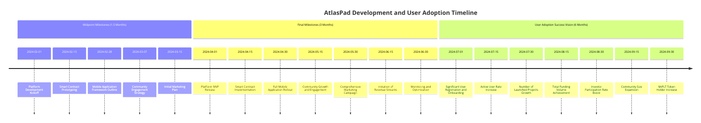

# 👀 Long-term Vision with MINA

<figure><figcaption>
Adoption MINA
</figcaption></figure>

1. <mark style="color:purple;">**Global Accessibility for MINA:**</mark> AtlasPad becomes a global platform accessible to users from all corners of the world, breaking down geographical barriers in crypto investments and project funding.\

2. <mark style="color:purple;">**Impactful NFT Marketplace:**</mark> AtlasPad's NFT marketplace hosts unique and high-value digital assets, attracting collectors, artists, and creators from various domains.\

3. <mark style="color:purple;">**Cutting-Edge Technology:**</mark> AtlasPad's dream scenario involves continuous technological innovation, staying ahead with cutting-edge features such as Layer 2 scaling solutions, AI integrations, and enhanced security measures. The platform will adapt to emerging trends to provide users with state-of-the-art tools and functionalities.\

4. <mark style="color:purple;">**Diverse Ecosystem:**</mark> The platform hosts a diverse ecosystem of crypto projects, ranging from startups to established enterprises, facilitating a broad range of fundraising activities, including ICOs, IEOs, STOs, NFT sales, and decentralized finance (DeFi) initiatives.\

5. <mark style="color:purple;">**High Trust and Security:**</mark> AtlasPad is recognized as a gold standard for security and trustworthiness within the crypto industry. Its smart contracts and zero-knowledge proof technology have been rigorously audited and proven secure. The dream scenario for AtlasPad includes being recognized as a trailblazer and innovator within the crypto and blockchain industry. Achieving a high level of trust among users, projects, and partners is fundamental to the platform's long-term success.\

6. <mark style="color:purple;">**User-Centric Features in zkApps:**</mark> The platform continually enhances user experience, offering intuitive interfaces, personalized dashboards, and advanced analytics tools to cater to the evolving needs of investors and project creators.\

7. <mark style="color:purple;">**Interoperability:**</mark> AtlasPad establishes partnerships and integrations with multiple blockchains, ensuring seamless cross-chain compatibility and allowing users to participate in a wide array of blockchain ecosystems.\

8. <mark style="color:purple;">**DeFi Integration:**</mark> The platform expands its DeFi offerings, including liquidity provision, yield farming, and decentralized exchange capabilities, contributing to the DeFi ecosystem's growth.\

9. <mark style="color:purple;">**Educational Hub for zkApps in DeFi:**</mark> AtlasPad becomes a hub for crypto education, offering comprehensive resources, workshops, webinars, and courses to educate both new and experienced users on crypto investing, blockchain technology, and financial literacy.\

10. <mark style="color:purple;">**Institutional Adoption:**</mark> The platform gains acceptance among institutional investors, who trust its robust security measures, compliance with regulatory standards, and transparent reporting.\

11. <mark style="color:purple;">**Strategic Partnerships EVM to MINA:**</mark> AtlasPad forms strategic partnerships with major blockchain projects, exchanges, regulatory bodies, and financial institutions, fostering collaboration and expanding its network.\

12. <mark style="color:purple;">**Global Regulatory Compliance:**</mark> The platform proactively navigates evolving regulatory landscapes in different jurisdictions, ensuring that it remains compliant with local and international laws, thus safeguarding the interests of its users.\

13. <mark style="color:purple;">**Sustainability and Scalability:**</mark> AtlasPad maintains a sustainable revenue model that fuels continuous development and scalability. Revenue-sharing mechanisms with project creators and token holders create a virtuous cycle of growth.\

14. <mark style="color:purple;">**Philanthropic Initiatives & Atlas Foundation:**</mark> In line with its vision, AtlasPad initiates philanthropic efforts to support blockchain-based social impact projects, contributing to positive change in society.\

15. <mark style="color:purple;">**Innovation Hub with MINA:**</mark> AtlasPad stays at the forefront of blockchain innovation by actively researching and implementing cutting-edge technologies, such as layer 2 scaling solutions, cross-chain communication protocols, and privacy-enhancing features.

\
