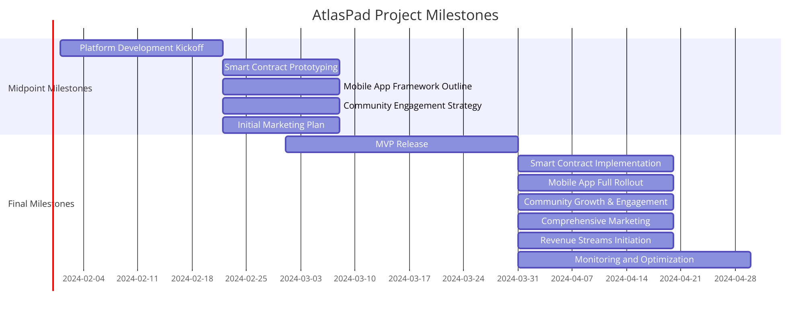

# 🛣 Milestones of "Atlaspad"

<figure><figcaption>
Milestones
</figcaption></figure>

#### Advanced Scope Milestones

Final Milestones (Within Three Months):

**1. MVP Platform Launch:**\
&#x20;   \- Release the Minimum Viable Product (MVP) with essential features.\
&#x20;   \- Collect user feedback for improvements.\
**2. Smart Contract Development:**\
&#x20;   \- Complete robust smart contract implementation for secure transactions.\
&#x20;   \- Perform security audits for vulnerability checks.\
**3. Mobile App Full Rollout:**\
&#x20;   \- Launch the complete AtlasPad mobile app.\
&#x20;   \- Ensure cross-platform compatibility.\
**4. Chatbot Integration:**\
&#x20;   \- Develop and integrate an AI chatbot for enhanced user support.\
**5. NFT Marketplace Creation:**\
&#x20;   \- Establish a dedicated NFT marketplace.\
**6. Community Growth:**\
&#x20;   \- Scale community engagement and social media presence.\
&#x20;   \- Implement feedback mechanisms.\
**7. Marketing Campaign:**\
&#x20;   \- Launch a comprehensive marketing campaign.\
&#x20;   \- Leverage partnerships and influencers.\
**8. Revenue Initiatives:**\
&#x20;   \- Implement income-generating features.\
**9. Monitoring and Improvement:**\
&#x20;   \- Implement monitoring tools.\
&#x20;   \- Iterate based on user feedback and market dynamics.

These final milestones include AI chatbot development, NFT marketplace creation, and mobile app optimization to enhance AtlasPad's functionality and user experience.

\
\
