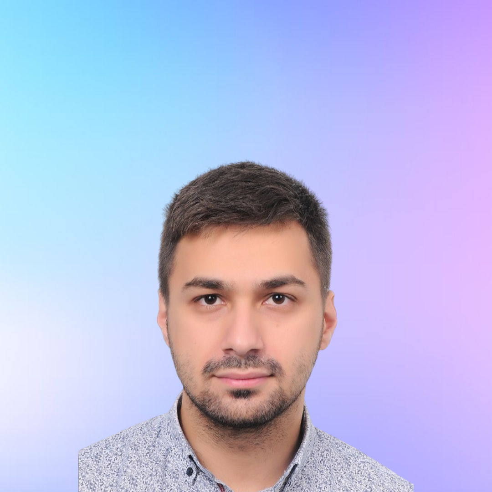
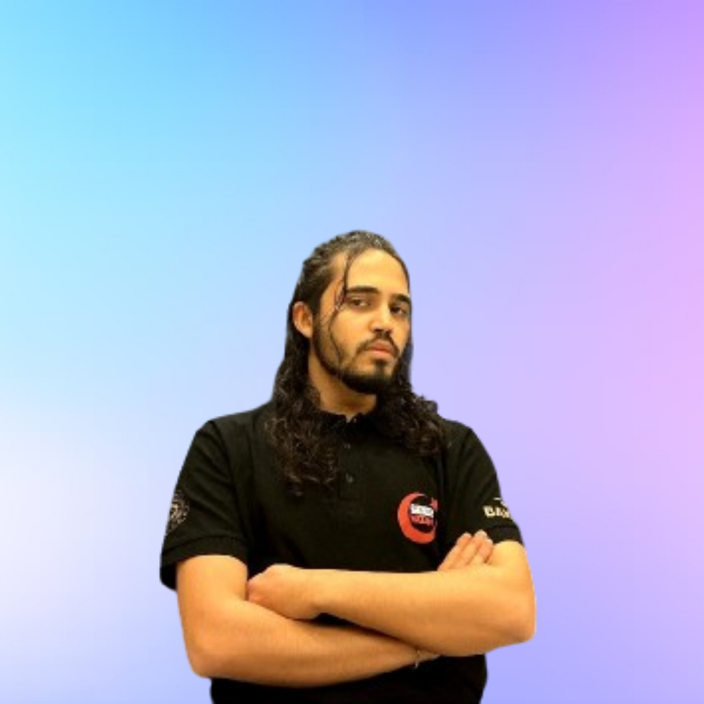

# 👥 Team of the "Atlaspad"

### Core Members

<figure><figcaption>
Çağlar Fırat
</figcaption></figure>

**Caglar Firat | CEO** \
\
&#x20;_Active in the crypto sector since 2019. Global community leader and BD & Kols manager at Kommunitas.net. Among the launch platforms he mediated are Daostarter, Trustfi, ixirpad, cheersland, erax. He is advising many unlisted projects._ \
_As of 2023 September, he is one of the founders of Atlaspad. Çağlar, in his role as Head of Com & BD at Dappad, played a pivotal role in shaping the project's communication strategy and facilitating the establishment of its community._

\
&#x20;_Working alongside the team, he diligently contributed to the successful adoption and growth of Dappad.app. At Dappgate, as the Communications Director, Çağlar led the team in managing the community-building process. Through effective communication strategies, they ensured that the project reached a wide audience, fostering its widespread acceptance. For Metaverse Wear, Çağlar secured funding by organizing VC meetings and highlighting the project's strengths. Throughout this process, he established strong communication with investors, emphasizing the project's potential. In his role as Community Manager for the Warena Project, Çağlar successfully managed the Turkish community and directed advertising processes. During this period, he effectively informed and engaged those interested in the project, resulting in the creation of a thriving community. Drawing from his experience in Cold Marketing,_&#x20;

\
&#x20;_Çağlar devised strategic plans for the Turkey, Arab, Russia, and China regions for ChadGPTCASH. In this process, he developed successful strategies by understanding regional differences and focusing on market needs. With GuruGPT, Çağlar had the opportunity to establish numerous collaborations in the Turkish market and contribute to the project's growth. He also secured funding by organizing VC meetings to support the project financially._

• linkedin: [https://www.linkedin.com/in/cfirat/](https://www.linkedin.com/in/cfirat/)

• github: [https://github.com/cfirat24](https://github.com/cfirat24)

<figure><figcaption>
Baturalp Güvenç
</figcaption></figure>

**Baturalp Güvenç | CTO** \
_Graduated Department: Computer Engineering. (2018)_ \
_Active SmartContract Developer: DATS Project & Arbeit Studio & Cuberium_ \
_Public Sector: He is the founder of the Siber Vatan Blockchain Team (Cuberium Sec.) established by the Republic of TR Digital Transformation Office and the Ministry of Technology and Industry of TR._

Skills:\
\
**React:** `Next.js` \
**Node.js:** `Express.js` \
**Typescript** \
**Smart Contracts:** `Solidity, OpenZeppelin` \
**Data fetching:** `Query` \
**API:** `GraphQL, OpenAPI` \
**Authentication:** `Oauth2, Auth0, Web3, Merkle Trees` \
**Cloud:** `Firebase, AWS` \
**Style:** `wagmi, three.js, styled-components, tailwind.css, Sass/scss` \
**ORM:** `Prisma Testing:Jest, Cypress, Integration:Infura, Stripe, Google, Youtube, GPT, Git` \
**UI:** `Figma, Spline, Dora` \
**Web3:** `EVM, Ceramic Network, Avalanche C Scroll, HAQQ, Moralis, APTOS, Sui, BNBchain, Goerli, Sepolia, Ganache, Hardhat, Berkeley` \
**Provider:** `Rainbow-Kit, Metamask-SDK, Ethers.js, Web3.js` \
**ZkApps:** `o1js, ZoKrates` \
**Work with (Experience):** `Scroll / DATS / Cheeseart / Simurglabs / Islamic Coin / Solana / Hyperledger / Sittaris` \
**Representative:** `Hyperledger, Solana Allstars, Aleo` \
\
• linkedin: [https://www.linkedin.com/in/baturalpguvenc/](https://www.linkedin.com/in/baturalpguvenc/)\
• old github (broken): [https://github.com/baturalpguvenc ](https://drive.google.com/file/d/1d7OUKvGZulWpJcqrspK7gN7f8gqVqEOG/view?usp=drive\_link)\
• new github: [https://github.com/virijlakrum](https://github.com/virjilakrum)

<figure><figcaption>
Sena Atay
</figcaption></figure>

**Sena Atay | CMO**

&#x20;_She graduated from Bilkent University, Information Technology and Information Systems. She knows various software languages like_ `C++, C#, Java, .NET.`

&#x20;_She is active in crypto world since 2021 and she worked as a community & marketing manager at Komodo, a company formed by the former co-founders of Ethereum. She also worked as_ `Flutter` _developer in the same project. She is recognised as a successful female executive in the industry. She also interests in mining and rig setup. She set up her own rig system and mined Ethereum for a long time. Additionaly, she loves to investigate new projects and make investments to them._\
\
_•_ linkedin: [https://www.linkedin.com/in/ataysena/](https://www.linkedin.com/in/ataysena/)

**Yunus Emre Yoldaş | Backend & Smartcontract Developer** \
&#x20;\
&#x20;Emre, at the age of 13, ventured into the world of computers, initially introduced to it by friends as a means to play games. For the first five years, he regarded computers merely as a source of entertainment. However, later on, the creative potential within this realm steered him towards programming. While exploring the Android community, Emre gained insights into the inner workings of mobile phones, with a particular fascination for the kernel. This fascination prompted a shift in his perception of computers, leading him to transition to the Linux ecosystem. The extensive possibilities it offered to developers, coupled with its ease of configuration, opened up new horizons in programming for him. In the initial months, Emre rapidly acquired proficiency in programming languages like C and C++. Challenges such as the lack of notifications for grade announcements from his university's automation system led him to delve into web scraping using Selenium and Python. He later optimized this process to use pure requests instead of emulating a browser window. Emre also developed practical tools to simplify his daily life. A chance encounter with colleagues during a random university event led Emre to join their community, which eventually became the foundation of their group. Within this group, his primary role has been to provide clients with web2/3 websites, all while standing out in the blockchain and cryptography domain through the use of TypeScript.

### Skills

React:Next.js, Nuxt.js, Vue.js Node.js Typescript Smart Contracts:Solidity, OpenZeppelin Operating Systems Authentication:Oauth2, Merkle Trees Cloud:Firebase, AWS Container:Docker Style:wagmi, Css, tailwind.css, Sass/scss Integration:Infura, Google, Youtube, GPT, Git UI:Figma Web3: EVM, HAQQ, Goerli, Sepolia, Ganache, Hardhat, Berkeley Provider:Rainbow-Kit, Metamask-SDK, Ethers.js, Web3.js ZkApps:o1js • linkedin: https://www.linkedin.com/in/yunus-emre-yolda%C5%9F/ • github: https://github.com/gAtrium

Yiğid Balaban |Frontend & UI/UX Developer Designing and developing desktop applications, websites, and information systems since 2019, I have leveraged my technical expertise in blockchain-related projects. I've also taken the lead in several university teams at hackathons and competitions, collaborating with four distinct technical student communities. Proficient in JavaScript/TypeScript, HTML, CSS, and SCSS, I have a strong command of programming languages such as C#, C, and Python, adapting these skills to blockchain development. My experience extends to version control systems like Git/GitHub and various project development methodologies, ensuring a well-rounded approach to blockchain technology.

### Skills:

React:Next.js, Nuxt.js, Barba.js Python Node.js:Express.js Javascript:Genesis.js API:GraphQL Authentication:Oauth2, Auth0 Cloud:Firebase, AWS Container:Docker Compose Style:wagmi, Css, Less, tailwind.css, Sass/scss Integration:Google, Youtube, GPT, Git UI:Figma, Dora, Relume, Adobe Photoshop Representative: IEEE

• linkedin: https://www.linkedin.com/in/fybx • github: https://github.com/fybx

Osman Nuri Yıldız |Full-stack Developer Full-stack web, mobile and Blockchain developer. Graduated from Computer Engineering in 2023. Presently working as a web and mobile developer remotely in iyiMakina, an Istanbul-based startup building an innovative online marketplace.Concurrently pursuing a master's degree in Business Administration (MBA). Active member of Cuberium, a Blockchain developer team. Participated in various Web3 events and hackathons, including Devconnect 2023, Istanbul Blockchain Week, and Solana Allstars meetings. Has extensive experience in technologies such as JavaScript, TypeScript, React, React Native, Linux, Git, and Docker. Additionally, has foundational experience in EVM-compatible smart contract development.

### Skills

React:Next.js, Nuxt.js, Vue.js Node.js:Express.js Typescript:o1js Smart Contracts:Solidity, OpenZeppelin API:GraphQL Authentication:Oauth2,Red-black Trees Cloud:Firebase, AWS Container:Docker Compose Style:wagmi, Css, Less, tailwind.css, Sass/scss ORM:Prisma Integration:Infura, Moralis, Google, Youtube, GPT, Git UI:Figma Web3: EVM, HAQQ, Goerli, Sepolia, Ganache, Hardhat, Berkeley Provider:Rainbow-Kit, Metamask-SDK, Ethers.js, Web3.js ZkApps:o1js, ZoKrates Work with (Experience): İyi Makine, Cuberium Security Representative: Hyperledger Foundation • linkedin: https://www.linkedin.com/in/osmannyildiz/ • github: https://github.com/osmannyildiz

Berk Çiçek | Smartcontract Developer

Web security, blockchain researcher, smart contract developer, backend developer, ZK researcher. As of 2021, Berk is a third-year computer engineering student at Bülent Ecevit University. In 2022, he became a student at Siber Vatan where he received training in cybersecurity, network, and web security. In the same year, through a startup competition, he began researching the benefits of blockchain in cybersecurity. In July 2023, with the support of the Ministry of Industry and Technology Digital Transformation Office, Berk founded Cuberium, Turkey's first blockchain team, within Siber Vatan. With the Cuberium team, he conducted training and studies on blockchain architecture and smart contracts. Together with the team, Berk established their own blockchain education platform, cublab.org In 2024, he started working as a contract developer at AtlasPad, continuing to improve himself in ZK (Zero-Knowledge) technology. Additionally, Berk is proficient in TypeScript and o1js, further enhancing his capabilities in the field of blockchain technology and development.

### Skills

Typescript:(o1js) Web: (HTML) Smart Contracts: (Solidity, OpenZeppelin) Container:Docker Compose Style:wagmi, Css Integration:Infura, Moralis, GPT UI:Figma Web3: EVM, HAQQ, Goerli, Ganache, Hardhat Provider:Metamask-SDK, Ethers.js, Web3.js ZkApps:o1js Work with (Experience): Serim Software Solutions, Cuberium Security Representative: Hyperledger Foundation • linkedin: https://www.linkedin.com/in/berk%C4%B1cekk

• github: https://github.com/berkcicekk

Team Members

Muhammed Akıncı Department: Software Engineering. Active Blockchain & AI Developer: Cuberium Public Sector: Artificial Intelligence and Blockchain developer of the Siber Vatan Blockchain Team (Cuberium Sec.) established by the TR Digital Transformation Office and the TR Ministry of Technology and Industry

### Skills

LLM & AI: (Python: Mathplotlib, Django, Numpy, BeautfiulSoup, Tensorflow) Application: (C, C++, C#) Web: (HTML, PHP) Javascript Framework: (React.js) Javascript API: (OpenAPI, OpenAI, Google, Kafka) Style: (CSS, SCSS) Integration: GPT, API UI: (Figma, Canva) Web3: (EVM, Hyperledger Fabric) Provider: (Metamask-SDK, Ethers.js) Work with (Experience): Cuberium / Islamic Coin / Solana / Hyperledger Fabric Representative: Hyperledger Foundation, Solana Allstars Ankara

• linkedin: https://www.linkedin.com/in/muhammedakinci/ • github: https://github.com/MuhammedAkinci

### Mehmet Hayırlı Department: Software Engineering. Active SmartContract Developer : Cuberium Public Sector: He is the founder of the Siber Vatan Blockchain Team (Cuberium Sec.) established by the Republic of TR Digital Transformation Office and the Ministry of Technology and Indusrty of TR. Skills:

React: (Next.js) Smart Contracts: (Solidity, OpenZeppelin) Authentication: (Web3) UI: (Figma) Web3: (EVM, Goerli, Sepolia, Ganache, Hardhat) Provider: (Metamask-SDK, Ether.js, Web3.js) ZkApps: (MINA Protocol, Basic o1js) Work with (Experience): (Cuberium / Solana / Hyperledger Foundation) Representative: (Hyperledger Foundation, Solana Allstars)

• linkedin: https://www.linkedin.com/in/mehmethayirli/ • github: https://github.com/mehmethayirli
